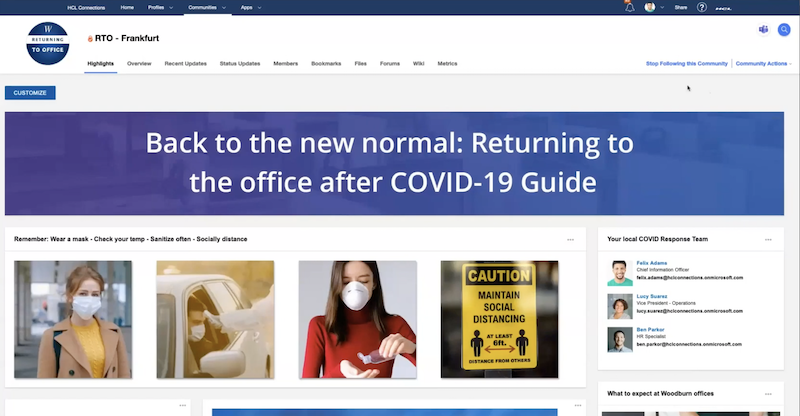
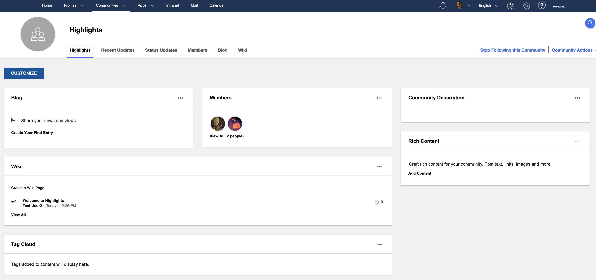
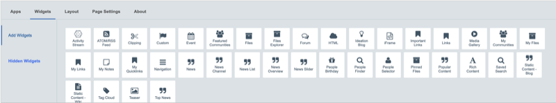
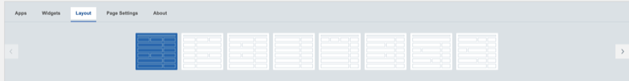
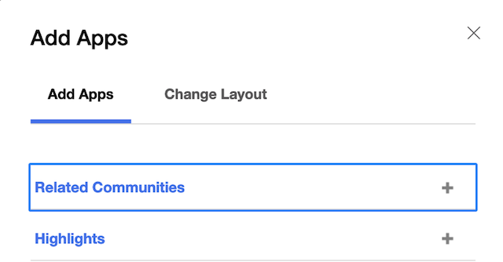
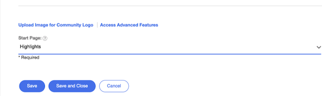

#What are highlights

Higlights is a new feature for a better and smoother community experience. It contains widgets that allow you to design your community. This is the new default for all new communities, Highlights will be set as your default landing page for your new community.

#Configure

When you create a new Community, Highlights is configured by default and will be the default landing page for your community, it will contain all widgets of the default applications for a new community. You can then add applications to your community and then the highlihts widget or pick widgets that are unrelated to a community feature.
As you can see in the image, the newly created community contains Blogs, Wikis and Rich Content by default and the Highlights app is added as well, the widgets on the highlights app by default on new community creation are: Blog, Members, Community Description, Wiki, Rich Content and Tag Cloud.

As a Community owner you will see a **Customize** button on the community landing page.
That will give you access to a set of Community applications on tab 1 and additional widgets on tab 2

On tab 3 you can also alter the layout of the landing page

#Add to existing Community

If you have an existing pre Connections 7 community, you can still add Highlights to it. As a community owner go to **Community Actions** **Add Apps** and add the **Highlights** App.

Then go to **Community Actions** **Add Apps** and select **Edit Community**. At the bottom of the settings make Highlights the landing page for your community

This will add all existing community widgets into the highlights app and you are ready to customize the Highlights application
