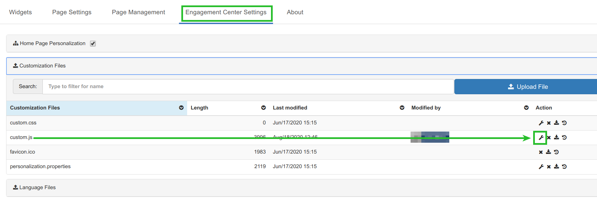
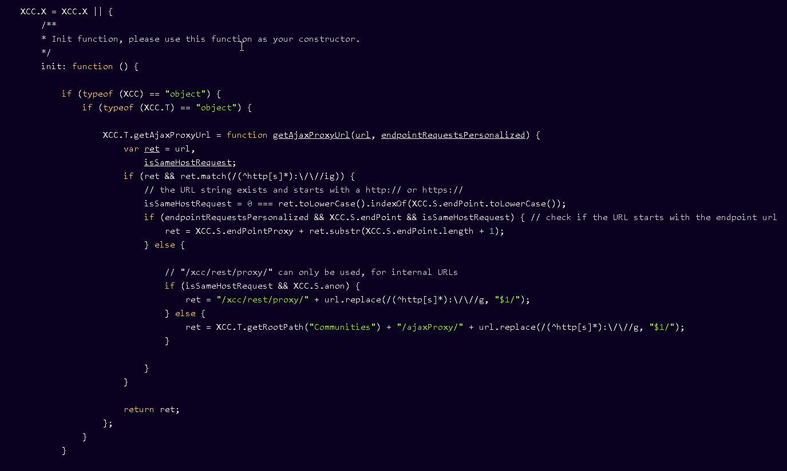

# Engagement Getting the Atom/RSS feeds to work

ICEC is in cloud mode which uses a tighter security model.  
It requires to whitelist any feed urls per default.

## Manage the whitelist

This gives you full control over the urls which can be accessed from Engagement Center RSS widget.
This requires access to the appregistry, which is not end-user friendly at the moment.
See [Detailed instructions](https://github.com/hclcnx/customizer/blob/master/docs/HCLConnectionsCustomizer.md#listing-17-simple-customizer-proxy-extension) for further informations.

## Open access

If you want to allow all URL's, the following JavaScript block needs to be added inside the init function within the custom.js in Engagement Center:

Goto customize->Engagement Center Settings -> Customization Files -> custom.js


``` js
/**
* Change the proxy to the connections AjaxProxy
*/
if (typeof (XCC) == "object") {
                if (typeof (XCC.T) == "object") {

                    XCC.T.getAjaxProxyUrl = function getAjaxProxyUrl(url, endpointRequestsPersonalized) {
                        var ret = url,
                            isSameHostRequest;
                        if (ret && ret.match(/(^http[s]*):\/\//ig)) {
                            // the URL string exists and starts with a http:// or https://
                            isSameHostRequest = 0 === ret.toLowerCase().indexOf(XCC.S.endPoint.toLowerCase());
                            if (endpointRequestsPersonalized && XCC.S.endPoint && isSameHostRequest) { // check if the URL starts with the endpoint url
                                ret = XCC.S.endPointProxy + ret.substr(XCC.S.endPoint.length + 1);
                            } else {

                                // "/xcc/rest/proxy/" can only be used, for internal URLs
                                if (isSameHostRequest && XCC.S.anon) {
                                    ret = "/xcc/rest/proxy/" + url.replace(/(^http[s]*):\/\//g, "$1/");
                                } else {
                                    ret = XCC.T.getRootPath("Communities") + "/ajaxProxy/" + url.replace(/(^http[s]*):\/\//g, "$1/");
                                }

                            }
                        }

                        return ret;
                    };
                }
            }
```

Place this in the init function in custom.js.


