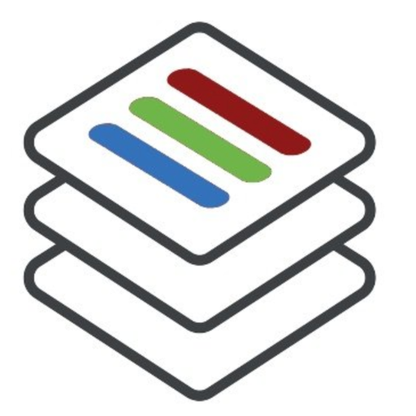

# ThreeThirds Collaboration Docs

---
>**Since the migration from Connections Multitenant the documentation has been moved to a [new location](https://docs.st.collab.cloud)**
The content on this page is no longer being updated.
---

{:style="width:20%;float:left;"} Welcome to the ThreeThirds Collaboration documentation site. Here you can find information about about the ThreeThirds HCL Connections and HCL Domino Mail managed cloud service.

ThreeThirds Collaboration is comprised of 3 companies [ISW](https://isw.com.au), [Belsoft](https://www.belsoft-group.ch/en/) and [Prominic](https://prominic.net/) who are industry leaders in HCL Digital Solutions including Connections, Notes/Domino, Sametime and many other software products formerly from IBM.

The ThreeThirds partnership was the first Cloud Provider chosen by HCL, and have extensive know-how and a highly technical skillset. You can feel confident that we offer a secure and safe Cloud environment.

For more information about our Cloud Offerings visit [collab.cloud](https://collab.cloud)

---

