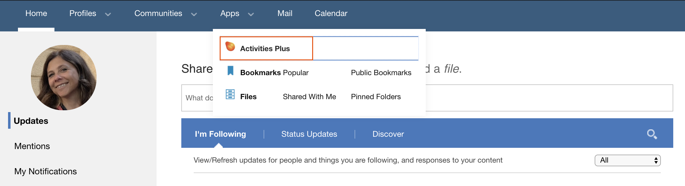
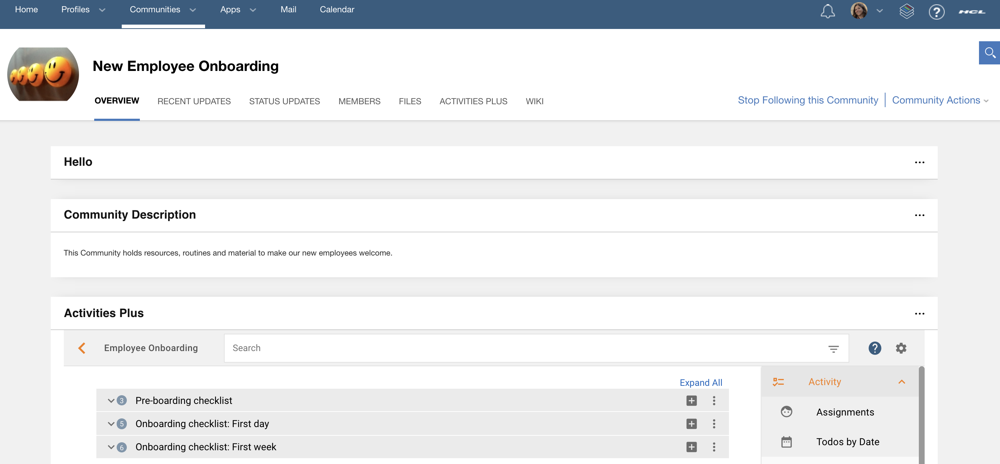

# Where Are the Activities?

Your existing Activities are migrated to Activities Plus. When you create a new Activity, it will be created in Activities Plus. The previous, older version of HCL Connections Activities is not available in our Connections Cloud any longer.

An Activity can be a **stand alone Activity** or a **Community Activity**.

## Stand Alone Activity

A stand alone Activity can be private for personal work and task management, or shared for collaborative work with colleagues in your organisation.

To access and work with a stand alone Activity, go to the Activities Plus page by clicking:

**_Apps – Activities Plus_** in the Menu Bar

Here you can work with your existing Activities, or create new ones. Both private Activities, public Activities and shared Activities.

## Community Activity

A Community Activity is an Activity that belongs to a specific HCL Connections Community. The members of the Community are also members of the Community Activity. Collaborate and access the Activity directly in the Community.

If you cannot see any Activities in a Community, the Activities Plus widget needs to be added to the Community. The Community Manager has access rights to do that.

___

## For more information, tips and tricks on how to work with Activities in Activities Plus

[Click here](https://docs.collab.cloud/users/aplus-tips-and-tricks/)
